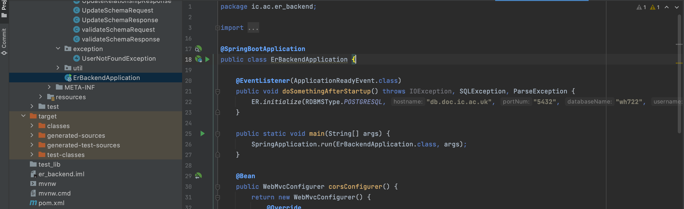
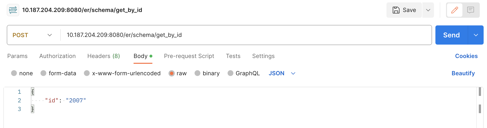

# ER Backend

This is the back-end application of the ER API project, which is a simple 
Java SpringBoot application

## Getting started

Since this application haven't been deployed, it can only
run locally currently.

Download this sub-project using the following command line:

```
git clone https://github.com/BoanZhu/ER-Backend.git
```

## How to use

After opening it the in the editor, run the application. This is inside the 'ErBackendApplication' file:



The default port of it is '8080', the address of the interfaces 
is the IP address of the laptop. 

### Examples

The following example shows the way to invoke the interface methods:



Interface method url: 'http://10.187.204.209:8080/er/schema/get_by_id'
